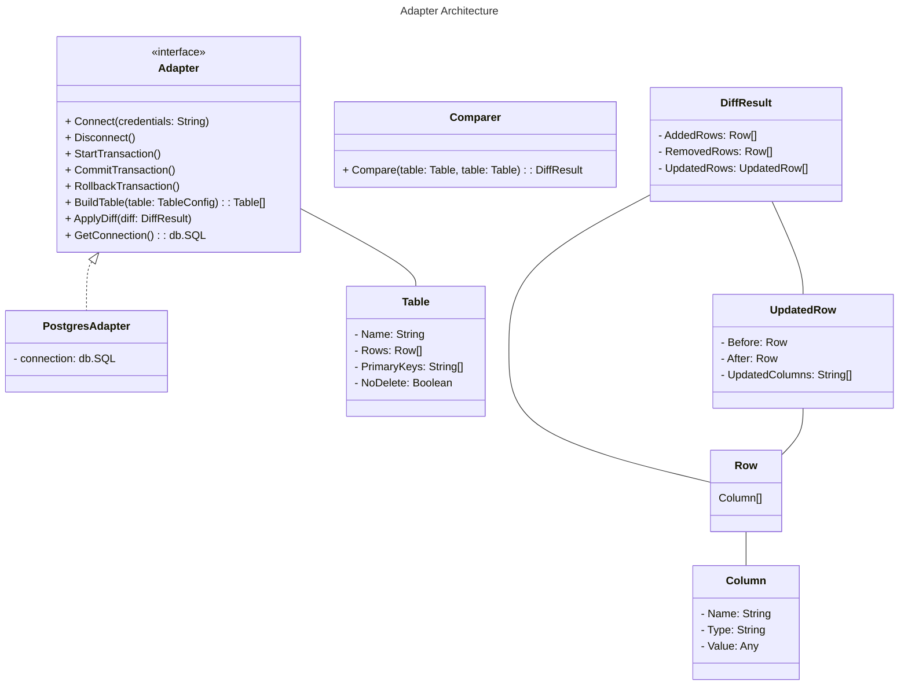

# Architecture New

```mermaid
---
title: Adapter Architecture
---

classDiagram
  
  class Adapter {
    <<interface>>
    + Connect(credentials: String)
    + Disconnect()
    + StartTransaction()
    + CommitTransaction()
    + RollbackTransaction()
    + BuildTable(table: TableConfig): Table[]
    + ApplyDiff(diff: DiffResult)
    + GetConnection(): db.SQL
  }
  
  class Comparer {
    + Compare(table: Table, table: Table): DiffResult
  }
  
  class PostgresAdapter {
    - connection: db.SQL
  }
  
  Adapter <|.. PostgresAdapter
  Adapter -- Table
  
  class Table {
    - Name: String
    - Rows: Row[]
    - PrimaryKeys: String[]
    - NoDelete: Boolean
  }
  
  class DiffResult {
    - AddedRows: Row[]
    - RemovedRows: Row[]
    - UpdatedRows: UpdatedRow[]
  }
  
  class UpdatedRow {
    - Before: Row
    - After: Row
    - UpdatedColumns: String[]
  }
  
  DiffResult -- Row
  DiffResult -- UpdatedRow
  UpdatedRow -- Row
  Row -- Column
  
  class Row {
    Column[]
  }
  
  class Column {
    - Name: String
    - Type: String
    - Value: Any
  }
    
```