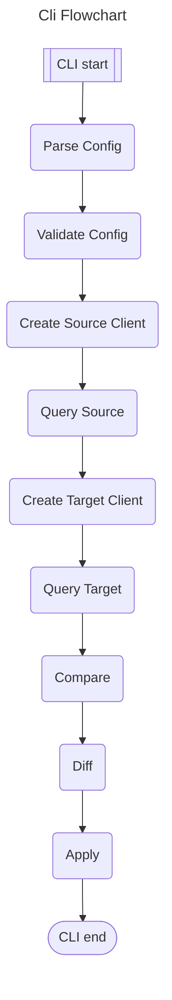

```mermaid
---
title: Cli Flowchart
---

flowchart
  start[[CLI start]]
  parse(Parse Config)
  validate(Validate Config)
  source(Create Source Client)
  target(Create Target Client)
  query(Query Source)
  queryTarget(Query Target)
  compare(Compare)
  diff(Diff)
  apply(Apply)
  commit([CLI end])
  
  start --> parse
    parse --> validate
    validate --> source
    source --> query
    query --> target
    target --> queryTarget
    queryTarget --> compare
    compare --> diff
    diff --> apply
    apply --> commit
  

```