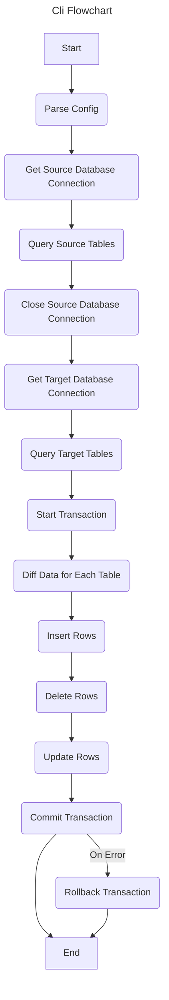

```mermaid
---
title: Cli Flowchart
---

flowchart
  start[Start]
  parseConfig(Parse Config)
  getSourceDB(Get Source Database Connection)
  querySourceTables(Query Source Tables)
  closeSourceDB(Close Source Database Connection)
  getTargetDB(Get Target Database Connection)
  queryTargetTables(Query Target Tables)
  startTransaction(Start Transaction)
  diffData(Diff Data for Each Table)
  insertRows(Insert Rows)
  deleteRows(Delete Rows)
  updateRows(Update Rows)
  commitTransaction(Commit Transaction)
  rollbackTransaction(Rollback Transaction)
  ende[End]
  start --> parseConfig
  parseConfig --> getSourceDB
  getSourceDB --> querySourceTables
  querySourceTables --> closeSourceDB
  closeSourceDB --> getTargetDB
  getTargetDB --> queryTargetTables
  queryTargetTables --> startTransaction
  startTransaction --> diffData
  diffData --> insertRows
  insertRows --> deleteRows
  deleteRows --> updateRows
  updateRows --> commitTransaction
  commitTransaction --> ende
  commitTransaction -- On Error --> rollbackTransaction
  rollbackTransaction --> ende

```
